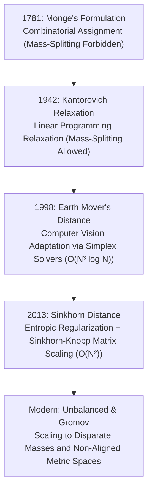

# Awesome-Sinkhorn-Distance
## 📐 The Sinkhorn Distance & Optimal Transport Map

The Sinkhorn Distance is a fundamental mathematical formulation in optimal transport, machine learning, and computer vision. It solves the classic Monge-Kantorovich Optimal Transport (OT) problem by adding an entropic regularization term, transforming a slow \(O(N^3 \log N)\) linear programming problem into a highly scalable, GPU-friendly \(O(N^2)\) matrix scaling operation via Sinkhorn's algorithm.Here is a comprehensive README.md tracking the mathematical details, evolutionary lineage, core algorithm, and modern machine learning applications of the Sinkhorn Distance.

> **A comprehensive reference guide for the Sinkhorn Distance—mapping its mathematical formulation, evolutionary lineage from classical Earth Mover's Distance, algorithmic execution, and deep learning implementations.**

The Sinkhorn Distance revolutionized optimal transport in machine learning by introducing entropic regularization. This single innovation transformed a computationally prohibitive linear programming bottleneck into a fast, differentiable matrix scaling problem that natively accelerates on modern hardware.

---

## 📅 The Evolutionary Timeline

The operational shift from discrete linear programming to continuous, entropic-regularized scaling.

---

## 🧭 Deep Dive: From Precursors to Sinkhorn

### 1. Monge's Optimal Transport (1781)
Gaspard Monge formulated the problem of moving a pile of dirt to a target excavation site with minimal effort. 
*   **The Constraint:** Mass could not be split. A single source point $x$ had to map entirely to a single target point $T(x)$.
*   **Limitation:** If the source and target geometries mismatched (e.g., mapping a single point mass to two split masses), a valid transport map $T$ mathematically could not exist.

### 2. Kantorovich Relaxation (1942)
Leonid Kantorovich relaxed Monge's rigid mapping by replacing the transport map with a joint probability distribution, known as a **transport plan** ($\pi$).
*   **The Advantage:** Mass splitting was now fully allowed. A source point could distribute its mass across multiple target points.
*   **Mathematical Form:** 
    $$W(r, c) = \min_{\pi \in U(r, c)} \langle \pi, C \rangle = \min_{\pi \in U(r, c)} \sum_{i,j} \pi_{ij} C_{ij}$$
    Where $C$ is the cost matrix, and $U(r, c)$ is the set of all valid joint distributions with row marginals $r$ and column marginals $c$.
*   **Limitation:** Solving this requires linear programming (e.g., the simplex method), which scales at an intractable $O(N^3 \log N)$ complexity.

### 3. The Earth Mover's Distance (1998)
Introduced to computer vision by Rubner et al., the Earth Mover's Distance (EMD) is a discrete instance of Kantorovich's formulation used to calculate distance histograms for image retrieval. While effective, it suffered from the same extreme linear programming computational bottlenecks.

### 4. The Sinkhorn Distance (Cuturi, 2013)
Marco Cuturi solved the computational bottleneck by adding an **Entropic Regularization** term ($H(\pi)$) directly to the Kantorovich problem.

$$W_\gamma(r, c) = \min_{\pi \in U(r, c)} \langle \pi, C \rangle - \gamma H(\pi)$$

Where $H(\pi) = -\sum_{i,j} \pi_{ij} \log \pi_{ij}$ and $\gamma > 0$ controls the regularizing strength.

*   **The Mathematical Breakthrough:** As a result of the regularizer, the optimal transport plan $\pi^*$ is structurally guaranteed to take the form of a diagonal scaling of a Gibbs kernel matrix:
    $$\pi^* = \text{diag}(u) K \text{diag}(v)$$
    Where $K_{ij} = \exp\left(-\frac{C_{ij}}{\gamma}\right)$, and $u, v$ are unknown positive scaling vectors calculated via fixed-point iterations.

---

## 🎛️ Algorithmic Execution: Sinkhorn-Knopp

Because the optimal plan scales a kernel matrix $K$, finding the vectors $u$ and $v$ is reduced to alternatingly forcing the row and column sums of $\pi$ to match the target marginals $r$ and $c$.

### The Iterative Loop
Given marginal vectors $r$ and $c$, and kernel $K$:
1. Initialize $v^{(0)}$ as a vector of ones.
2. Repeat until convergence:
   $$u^{(t+1)} = \frac{r}{K v^{(t)}}$$
   $$v^{(t+1)} = \frac{c}{K^T u^{(t+1)}}$$

This algorithm utilizes only basic **matrix-vector multiplications**, which can be distributed seamlessly across GPU Tensor Cores.

---

<layout>
chartPlaceholder(chartDescription = "The trade-off curve between regularizer strength (gamma) and computational complexity, illustrating the convergence of Sinkhorn Distance toward classical Earth Mover's Distance as gamma approaches zero.", results = [])
</layout>

---

## 🚀 Real-World Applications in Modern AI

*   **Generative Modeling (Sinkhorn Autoencoders & GANs):** Used as an alternate loss function to the Kullback-Leibler (KL) divergence or vanilla Wasserstein loss. It provides smooth, non-vanishing gradients even when the generated and true data distributions do not physically overlap.
*   **Self-Supervised Learning (SwAV):** Used in clustering-based representation learning. The Sinkhorn-Knopp algorithm enforces a fair, uniform assignment of images across latent cluster prototypes, entirely preventing the model from collapsing into a single cluster.
*   **Graph Matching & Point Cloud Registration (SuperGlue):** Matches feature keypoints across disparate camera angles or 3D coordinate fields by treating keypoint alignment as an optimal transport problem.
*   **Natural Language Processing (Word Mover's Distance):** Evaluates semantic document similarity by tracking the minimal Sinkhorn cost required to travel from the token embeddings of Document A to the token embeddings of Document B.
